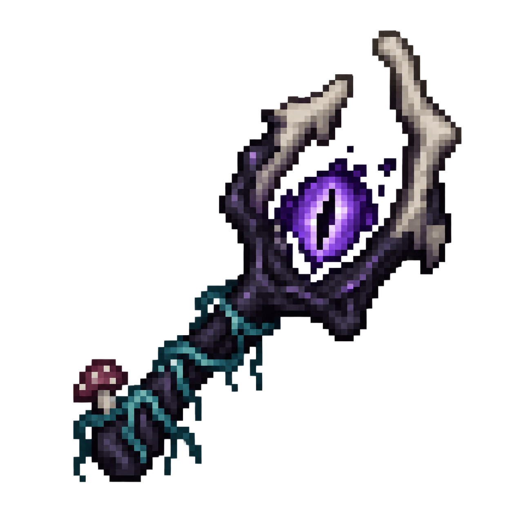

# Sporebound: The Blighted World

**Cross into a fungal world. Fight the infection—or become part of the Hive.**

Sporebound is an independent addon for **Fungal Infection: Spore**. Explore a corrupted dimension, discover survivor colonies, and develop Hivebound abilities while keeping other dimensions dormant until you choose to awaken them.

**Minecraft 1.21.1 · NeoForge · Java 21 · Current release: 0.8.0**

[**Download 0.8.0**](https://github.com/OuterRingFoundry/SporeAddition/releases/tag/v0.8.0) · [Installation](docs/INSTALLATION.md) · [Player guide](docs/PLAYER_GUIDE.md) · [Report a bug](https://github.com/OuterRingFoundry/SporeAddition/issues/new/choose)

## Inside the Blighted World

- **A fractured fungal landscape.** Explore drowned hollows, pale mycelial highlands, Spore ruins, and surviving groves.
- **Corruption that changes the fight.** Each dimension saves its own infection index; local pressure affects creatures, fog, and exposure.
- **Hivebound progression.** Craft living armor, evolve, climb walls, sense distant Hive Minds, and travel between network nodes.
- **Survivors who build and adapt.** Colonies gather supplies, improve equipment, and fight together with archers and shield defenders.
- **Deliberate containment.** The Overworld, Nether, and End start dormant. Overworld mushroom fields remain permanent sanctuaries.
- **Reusable cairn travel.** Open a Rift Cairn with a talisman and one ender pearl; later crossings through that activated cairn cost no more pearls.

Version **0.8.0 — The Living Frontier** adds restored pale terrain, Hive controls and beacons, affordable armor, wall climbing, survivor progression, and coordinated squads. [Read the release notes →](docs/RELEASE_0.8.0.md)

## Install

| Required component | Version |
| --- | --- |
| Minecraft: Java Edition | **1.21.1** |
| NeoForge | **21.1.249** (validated version) |
| Java | **21** |
| Fungal Infection: Spore | **2.2.0j**, [CurseForge file 8342823](https://www.curseforge.com/minecraft/mc-mods/fungal-infection-spore/files/8342823) |
| Sporebound | **0.8.0**, [GitHub release](https://github.com/OuterRingFoundry/SporeAddition/releases/tag/v0.8.0) |

Install **Spore and Sporebound on both the server and every client**, using matching versions. Download the release JAR rather than GitHub's source-code ZIP, remove older Sporebound JARs, and back up existing worlds before upgrading.

Spore is required and distributed separately. Optional Civillis and ConcentricWorld integrations are documented in the [compatibility guide](compatibility/README.md).

[Full installation, checksum verification, and upgrade guidance →](docs/INSTALLATION.md)

## Take your first trip

1. Craft a **Rift Talisman**: ender eye in the center, amethyst shards in the corners, crying obsidian on the edges.
2. Build a flat 3×3 **Rift Cairn** with an amethyst-block center, crying-obsidian edges, and polished-deepslate corners. Leave three air blocks above it.
3. Carry an ender pearl and use the talisman on the center. The first successful survival crossing activates and melts the cairn.
4. In the Blighted World, use the talisman anywhere to return for free. If you lose it, use an empty main hand on a complete cairn.

Start with the [player guide](docs/PLAYER_GUIDE.md) for the layout, progression, controls, and operator commands. New terrain appears in **newly generated chunks**; existing landscapes are not rebuilt.

## Documentation

| Looking for… | Start here |
| --- | --- |
| Setup, upgrades, and troubleshooting | [Installation](docs/INSTALLATION.md) |
| Travel, corruption, Hivebound, and survivors | [Player guide](docs/PLAYER_GUIDE.md) |
| What changed | [Changelog](docs/CHANGELOG.md) |
| Test evidence and known limits | [Validation](docs/VALIDATION.md) |
| Build instructions and repository layout | [Development](docs/DEVELOPMENT.md) |
| Bugs, suggestions, and pull requests | [Contributing](CONTRIBUTING.md) |
| All documentation | [Documentation index](docs/README.md) |

The 0.8.0 release passed clean build/unit checks, server and restart acceptance, and a real-client test. These checks do not establish long-duration multiplayer stability or performance across every modpack. [See the evidence and scope](docs/VALIDATION.md).

## Credits and license

Created by **OuterRingFoundry**. Fungal Infection: Spore is by **Harbinger**; Sporebound is an independent addon, not an official Spore release.

**All Rights Reserved.** See [LICENSE](LICENSE), [third-party notices](THIRD_PARTY_NOTICES.md), and [asset provenance](docs/art/fungal-assets.md). Third-party dependencies retain their own licenses.
